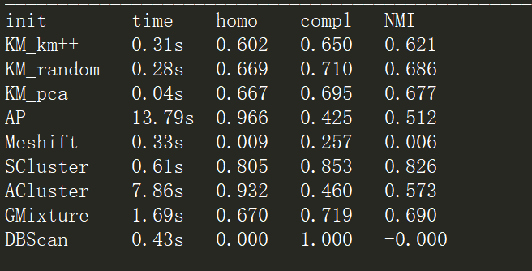
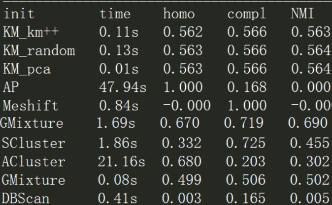

# ex1实验报告
课程名称：Data Mining

姓名：向卫星
</br>学号：201934738
## 1. 实验要求
在手写数字数据集和20个新闻组数据集上实现MiniBatchKMeans、KMeans、DBSCAN、AgglomerativeClustering、SpectralClustering、AffinityPropagation、MeanShift和GaussianMixture等聚类方法，并使用normalized_mutual_info_score、homogeneity_score、completeness_score对其聚类结果进行评估和分析
### 1.1 数据说明
#### 1.1.1 手写数字数据集
导入数据 from sklearn.datasets import load_digits 
</br>加载数据 digits = load_digits()
>digits 是手写数字的数据集，它的类型是bunch，即继承与字典的一种链式松散饿存储结构。其中digits所包含的数据分为data、target、target_names、images、DESCR
</br>data是具体数据 ， 将images按行展开成一行，共有1797行
</br>images 是一个1797 * 8 * 8 的三维矩阵，即由1797 张 8 * 8 的数字图片组成
</br>target 指明每张图片的标签，也就是每张图片代表的数字
</br>target_names数据集中所有标签值
</br>DESCR是一些作者的描述信息
#### 1.1.2 20个新闻组数据集
导入数据 sklearn.datasets import fetch_20newsgroups,而最重要的就是fetch_20newsgroups方法
>fetch_20newsgroups(data_home=None,subset='train',categories=None,shuffle=True,random_state=42,remove=(),download_if_missing=True)
</br>data_home指的是数据集的地址，如果默认的话，所有的数据都会在'~/scikit_learn_data'文件夹下.
</br>subset就是train,test,all三种可选，分别对应训练集、测试集和所有样本。
</br>categories:是指类别，如果指定类别，就会只提取出目标类，如果是默认，则是提取所有类别出来。
</br>shuffle:是否打乱样本顺序，如果是相互独立的话。
</br>random_state:打乱顺序的随机种子
</br>remove:是一个元组，用来去除一些停用词的，例如标题引用之类的。
</br>download_if_missing: 如果数据缺失，是否去下载
## 2. 实验记录
### 2.1 实验环境
硬件环境：</br>
</br>软件环境：</br>Python3</br>Visual Studio Code 1.38.1
### 2.2 实验过程
在实验的过程中使用的是sklearn官方提供的用例<plot_kmeans_digits.py>为模板，并对其进行部分修改。
### 2.2.1手写字体和新闻数据加载过程
</br>1.手写数字数据加载
</br>先是对数据的加载，然后提取出数据中的各个属性，包括总的类别数以及每个图片的8*8数据，并使用scale()函数对其归一化，避免特征方差过大导致忽略部分特征
```python
digits = load_digits()                  #数据集
data = scale(digits.data)              #标准化
n_samples, n_features = data.shape   #数据总数 特征总数
labels = digits.target               #每一个特征对应的真实的分组的标签
n_digits = len(np.unique(labels))    # 类的总数
sample_size = 300                     #样本数
```
</br>2.新闻数据的加载过程
</br>在对新闻数据获取以及处理的过程中它包括数据预处理(preprocessing)(正则化，归一化等)，特征提取(feature_extraction)(TFIDF等)，降维(decomposition)(PCA等)
```python
>dataset = fetch_20newsgroups(subset='all', categories= categories ,shuffle=True, random_state=42)  #获取数据
labels = dataset.target#标签
true_k = np.unique(labels).shape[0]#类别数
vectorizer = TfidfVectorizer(max_df=0.5, max_features=10000,min_df=2, stop_words='english',use_idf=True)#将数据向量化
X = vectorizer.fit_transform(dataset.data)
vd = TruncatedSVD(n_features_reduction) #将其降维
normalizer = Normalizer(copy=False)
lsa = make_pipeline(svd, normalizer)
X = lsa.fit_transform(X)
```
### 2.2.1构造聚类器 实现实验中要求的聚类
```python
cluster_test(KMeans(init='k-means++', n_clusters=n_digits, n_init=10),name="KM_km++", data=data)
cluster_test(KMeans(init='random', n_clusters=n_digits, n_init=10),name="KM_random", data=data)
pca = PCA(n_components=n_digits).fit(data)   #pca先找出簇的中心点
cluster_test(KMeans(init=pca.components_, n_clusters=n_digits, n_init=1),name="KM_pca",data=data)
cluster_test(AffinityPropagation(damping=0.6,max_iter=100,preference=-50),name="AP",data=data)#阻尼系数和最大迭代次数
bandwidth=estimate_bandwidth(data, quantile=0.2, n_samples=900)   #本身不知道要聚类的数目 所以做出来的聚类效果并不是很好
cluster_test(MeanShift(bandwidth=bandwidth, bin_seeding=True),name="Meshift",data=data)
cluster_test(SpectralClustering(n_clusters=n_digits, eigen_solver='arpack',affinity="nearest_neighbors"),name="SCluster", data=data)
cluster_test(AffinityPropagation(max_iter=100,convergence_iter=10,copy=False),name="ACluster", data=data)
cluster_test(GaussianMixture(n_components=n_digits),name='GaussianMixture', data=data)
cluster_test(DBSCAN(),name="DBScan", data=data)
```
### 2.2.1对数据进行聚类并使用评估函数进行评估
```python
def cluster_test(estimator, name, data):
    t0 = time()         #开始事件
    estimator.fit(data) #根据聚类器 开始聚类
    if hasattr(estimator, 'labels_'):#GaussionMixture没有label_属性
        pre_labels = estimator.labels_
    else:
        pre_labels = estimator.predict(data)
    print('%-9s\t%.2fs\t%.3f\t%.3f\t%.3f'
      % (name, (time() - t0),               #聚类时间
             metrics.homogeneity_score(labels, pre_labels),#每一个聚出的类仅包含一个类别的程度度量 越大越好
             metrics.completeness_score(labels, pre_labels),#每一个类别被指向相同聚出的类的程度度量
             metrics.adjusted_mutual_info_score(labels, pre_labels,average_method='arithmetic'),
             ))
```
对所有的聚类进行评估并输出比对
### 2. 实验结果以及分析
1. 实验运行结果
</br>手写数字聚类运行结果：
</br>
</br>新闻数据聚类运行结果(分为四类运行的结果)：
</br>
2.实验分析
</br>从程序运行结果的第一列time可以看得出，无论是在手写数字数据集还是新闻数据集上MiniBatchKMeans算法聚类速度是最快的其运行时间最少，也可以看出即使是fetch_20newsgroups这种数据量比较大的的情况下聚类的速度也还是很快，相对于AffinityPropagation和MeanShift这两个算法来说其运行速度是比较慢的;所以可以看得出对于KMeans算法来说对于初始的簇中心选取会影响算法的聚类速度的，如果簇中心选取的适当其运行时间会大大减少。对于总的聚类效果来说AffinityPropagation聚类的效果最好，但是其聚类的时间比较长。
</br>3.实验心得
</br>3.1初步掌握了基本的聚类算法，以及了解和实现了评估函数，也使得对机器学习的聚类产生了更多的兴趣，也想在更多的课余时间自己动手写出聚类算法。
</br>3.2学会使用markd写文档，以及对GitHub的使用。
